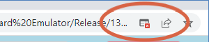

### 1200-Para, 2-Power Probe Card Emulator 사용법.

Wafer Map과 Bank Map에 대해서는 임의로 값을 지정하였기 때문에 실제와 많은 차이가 있을 수 있습니다.

Off-line으로 Emulator를 실행하기 위해서는 압축 파일(`1200-Para Emulator.zip`)을 압축 해제하고, 압축 해제된 폴더(`1200-Para Emulator`)에서 `index.html` 파일을 `double-click`하여 실행할 수 있습니다.

On-line으로 Emulator를 실행하기 위해서는 `https://silicon-precision.github.io/1200Para_LPS1004/`에 접속하여 사용해 볼 수 있습니다.

On-line이던 Off-line이던 Emulator를 실행하면 브라우저에 아래와 같이 실행됩니다.

GUI 구성에서 "Init" 버튼은 실제 Probe-Card에서  전원이 인가 될때 실행할 PS1120의 초기화 명령을 실행합니다.

"Init" 버튼을 클릭하시면, 아래와 같이 PS1120 Command가 실행됩니다. PS1120의 초기화 명령이므로, Probe-Card와 DUT에는 영향을 미치지 않습니다. 실제 Probe-Card에서는 FPGA Initialize 과정에서 실행되는 명령입니다.

실행된 명령의 Timing을 보기 위해서는 명령 Text를 "Shift + click"하시면, Timing 창이 팝업됩니다.

브라우저의 설정에 따라서 "Timing 창"이 팝업되지 않을 수도 있습니다. Emulator 창의 우측 상단을 확인하시기 바랍니다.

"팝업 차단" 기능이 설정되어 있을 수 있습니다. 
"팝업 차단"을 해제하기 위해서는 아래와 같이 ICON을 클릭하고, "항상 허용"을 선택하셔야 합니다.

`PS1120 Command`에 대해서는 향후 "PS1120 Emulator"를 통해서 설명하도록 하겠습니다.

#### LSP1004 Flag Read 하기.

ATE 장비로 부터 DUT의 CLS Flag를 Check하라는 명령을 받았다면, FPGA에는 순차적으로 PS1120을 제어하여 LPS1004의 CLS Flag를 read하여 결과를 ATE 장비로 전달할 것입니다.

Emulator에서는 ATE 장비의 명령을 받은 이후 동작을 설명 드리겠습니다.

`Next` 버튼을 클릭하여 1200-DUT 중에서 20-DUT의 CLS Flag를 read합니다. 이때 PS1120의 Switch를 제어하기 위해서 명령이 아래와 같이 보여집니다.

Emulator 화면에서 "DUT-1"이 파란색으로 표시되어 있는 것은 "DUT-1"과 연결된 LPS1004의 동작 상태를 새로운 팝업 창으로 보여준다는 표시 입니다.

모니터 좌측 상단에 새로운 팝업 창이 생성됩니다.

즉, LPS1004의 ENABLE 핀을 제어하는 PS1120과 LSP1004의 CLS Flag를 선택하는 PS1120이 그림과 같이 동작하여 DUT-1의 VDD1, VDD2의 상태를 확인합니다.

그림과 같이 동작하기 위해서는 회로 구성이 Emulator와 동일하게 구성되어야 합니다.

Emulator 창에서 `Next` 버튼을 클릭하면 "DUT-2"를 포함한 20개 DUT가 선택되고, 각 DUT에 전원이 공급되면서 CLS Flag를 Read 할수 있습니다.

동일한 방법으로 60회 반복하여 1200 DUT의 VDD1, VDD2의 상태(CLS)를 Read할 수 있습니다.(60 x 20 = 1200)

#### Emulator의 회로 구성.

앞서 Emulator에서 PS1120 Command는 회로 구성에 맞게 생성된 명령이기 때문에 Probe-Card의 회로 구성이 변경되거나 PS1120의 Switch 연결이 다르다면 PS1120 Command는 다르게 생성되어야 합니다.

Emualtor 창에서 Wafer 영역을 클릭하시면, 현재 Emulator에서 사용한 회로 구성을 확인할 수 있습니다.

위와 같이 Wafer 영역에서 DUT가 없는 부분을 클릭하면 아래와 같이 Top 회로 구성 창이 팝업됩니다.

1200 DUT를 4개의 Bank로 구성했습니다. 즉, Bank당 300개의 DUT가 구성됩니다.
FPGA에서는 각 Bank와 통신하기 위한 SPI Channel과 CLS Flag를 read하기 위한 40-Pin이 할당되어 있습니다.
즉, FPGA에서 1번에 Read하는 CLS Flag는 40개이고, 20-DUT에 대한 VDD1, VDD2를 받을 수 있습니다.

그림에서 Bank 영역을 클릭하여, 각 Bank의 회로구성을 확인할 수 있습니다.

Bank는 5개의 Page와 Mode/CL Control 부분으로 구성됩니다.
각 Page는 ENABLE Control 블럭과 CLS Flag Read 블럭, LPS1004 블럭으로 구성됩니다.

각 Page에서 ENABLE CONTROL 블럭과 CLS FLAG READ 블럭은 동일한 SCLK, SDI와 연결되고, CSN만 다르게 연결되어 있습니다. 즉, 동일한 Switch 구성인 경우에는 동일한 Command를 한번에 전송할 수 있습니다.

각 블럭의 회로 구성은 해당 블럭을 클릭하여 확인 할 수 있습니다.

먼저, ENABLE CONTROL 블럭을 클릭해서 회로 구성을 볼 수 있습니다.

PS1120(120-channel)의 각 Channel과 ENABLE Signal의 위치를 확인하시기 바랍니다. EN0는 channel-0에 할당되어 있고, EN1은 channel-60에 할당되어 있습니다.

다음으로 CLS FLAG READ 블럭을 클릭해서 회로 구성을 확인 합니다.

PS1120(120-channel)에서 CLS0는 channel-0에 할당되어 있고, CLS1은 channel-60에 할당되어 있습니다.

PAGE 블럭을 클릭해서 LPS1004와 DUT의 회로 연결을 확인할 수 있습니다.

PAGE에 30개의 UNIT으로 구성되어 있고, 각 UNIT은 동일한 방법으로 회로가 구성되어 있습니다. UNIT 영역을 클릭해서 회로 구성을 보시기 바랍니다.

위 그림에서 DUT-1에 VDD1, VDD2를 공급하기 위해서 EN0, EN2가 Active되어야 하고, LSP1004의 AOUT0와 AOUT2의 CLS Flag는 CLS0, CLS2로 연결되어 있습니다.

따라서, DUT-1에 전원을 공급하기 위해서 ENABLE CONTROL 블럭에서 PS110의 Channel-0와 Channel-60을 ON시키고, DUT-1으로 공급되는 전원의 상태(CLS)를 Read하기 위해서 CLS FLAG READ 블럭에서 PS1120의 Channel-0와 Channel-60을 ON시킨다. 즉, 2개의 PS1120을 동일하게 동작하기 때문에 동일한 명령을 입력할 수 있습니다.

아래 그림과 같이 Emulator의 DUT 상태 창을 참조할 수 있습니다.

